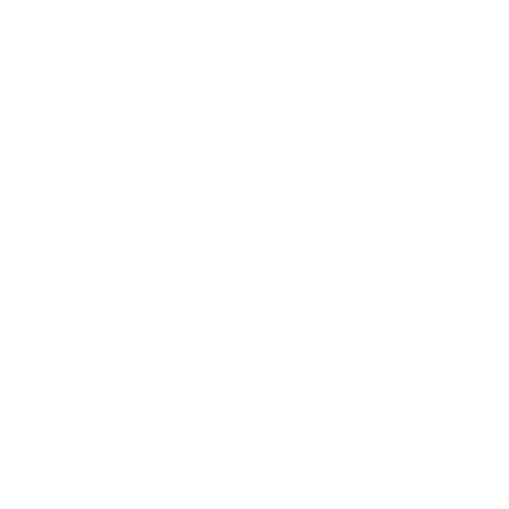

<!-- Header -->
<h1 align="center">Name's, <strong>Mastwal Mesfin</strong></h1>
<h2 align="center"><strong>Co-Founder and CTO of ASCII Technologies PLC.</strong></h2>

  

    Next.js · TypeScript · Prisma · Laravel . Django . C++ . Flutter . Nix . Python . Java . Shell. LUA . C . Golang . Dart . Hono . Astro

---

## About Me

- Building real-time & production-grade web apps
- Linux expert (Arch, NixOS, Debian, server optimization)
- Love declarative infra — especially **NixOS**
- Focused on **Offline-First / Local-First architectures**, enterprise management systems, and SaaS ecosystems
- Experience with PowerSync, WebSockets, Docker, Prisma, Redis, and REST APIs
- Currently learning advanced DevOps and system architecture
- Learning advanced backend architecture & distributed systems
- Love solving complex problems and optimizing workflows
- Favourite languages are C, Python and Golang

---

## Tech Stack

### **Frontend**

  
  
  
  
  
  

### **Backend**

  
  
  
  
  
  

### **Databases**

  
  
  
  
  

### **Frameworks, Platforms and Libraries**

  
  
  
  
  
  

---

## Connect With Me

  
  
  

---

<h3 align="center">✨ Arigato for visiting my profile ✨</h3>
